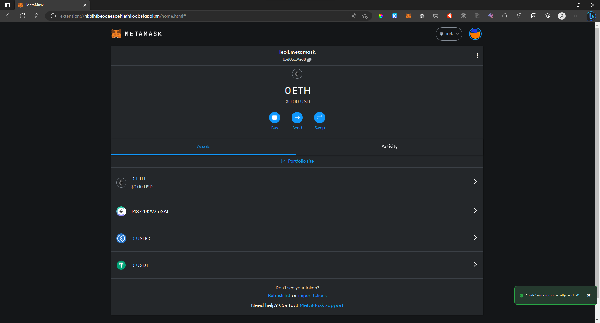

1. 按照指示跑成功後，上傳程式碼至學院 Github 並截圖程式碼畫面，需附說明作法 (README.md)
    - 實作 Mainnet fork with hardhat，用 Ganache-cli 跑 local 的 ethereum mainnet fork 並 connect MetaMask

        (參考資料 : [https://hardhat.org/hardhat-network/guides/mainnet-forking.html](https://hardhat.org/hardhat-network/guides/mainnet-forking.html))

### 主網分岔的兩種方法 (Hardhat & Ganache-cli)

1. 參考 [Infura API Key](..\Individual\coding\asset\Infura%20API%20Key.md) 設置測試網
2. 使用 Hardhat 分岔主網
   1. 透過 [Hardhat](..\Individual\coding\asset\Hardhat.md) 完成 Hardhat 安裝及初始化
   2. 打開終端機並輸入下列指令分岔主網，其中 `<key>` 為步驟一取得的 Infura API Key
   ```
   npx hardhat node --fork https://mainnet.infura.io/v3/<key>
   ```
   
   
3. 使用 Ganache-cli 分岔主網
   1. 打開終端機並使用下列指令安裝 [Ganache-cli](https://www.npmjs.com/package/ganache-cli)
   ```
   npm install -g ganache-cli
   ```
   2. 輸入下列指令分岔主網，其中 `<key>` 為步驟一取得的 Infura API Key
   ```
   ganache-cli -d -f https://mainnet.infura.io/v3/<key>
   ```
   
   
4. 打開 MetaMask 手動添加分岔網路


5. 填入相關資訊，按下 `SAVE` 即可成功添加
(`New RPC Url` 相當於 `https://mainnet.infura.io/v3/<key>`)



1. 加分題（optional）：
    - 如果想跟上最新的區塊鏈開發者趨勢，可以用看看 [https://zerodev.app/](https://zerodev.app/) 與 [https://www.stackup.sh/](https://www.stackup.sh/) 並閱讀網站內的相關文章，對參加區塊鏈論壇和與產業人士交流非常有幫助，會讓人把你歸類為 insider，就算只是知道有這些工具的存在，能夠加入其他人的話題也很有幫助
        - 可以將使用心得與重點整理筆記提交至 GitHub README
