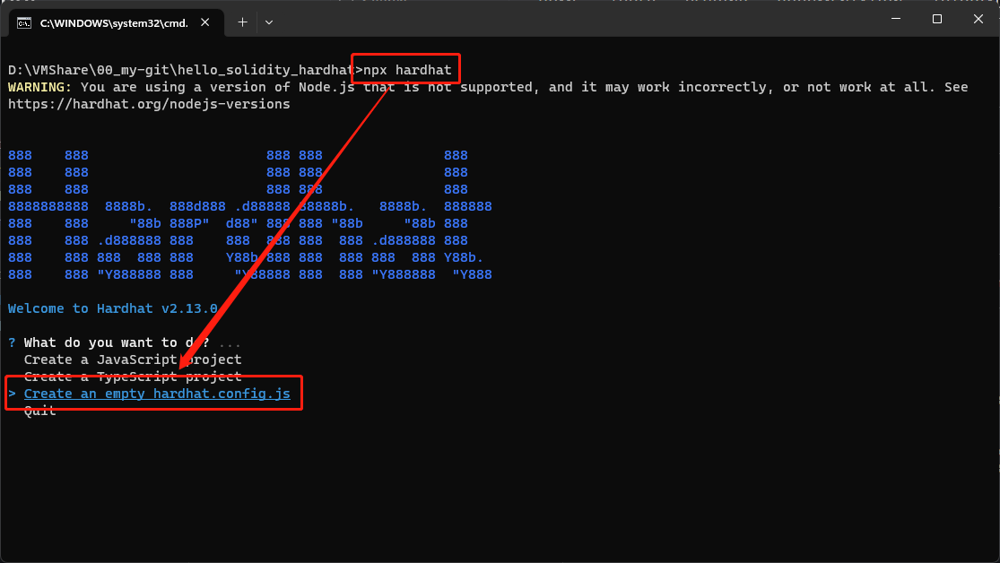

[README](..\README.md)

# 如何初始化 Hardhat

* [官方教學](https://hardhat.org/tutorial/creating-a-new-hardhat-project)

1. 創建一個空資料夾並輸入下列指令來初始化環境
```
npm init -y
npm install --save-dev hardhat
npm install --save-dev @nomicfoundation/hardhat-toolbox
npm install --save-dev chai
```
2. 輸入下列指令，並選擇 `Create an empty hardhat.config.js` 來創建 Hardhat 設定檔
```
npx hardhat
```


* 常用 Hardhat 指令
```
npx hardhat compile
npx hardhat test
```