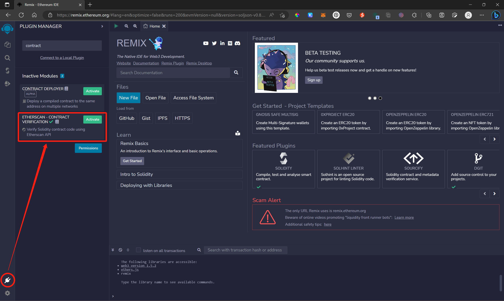
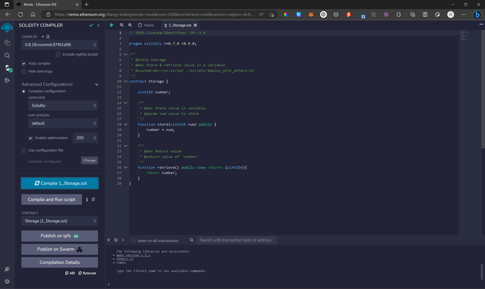
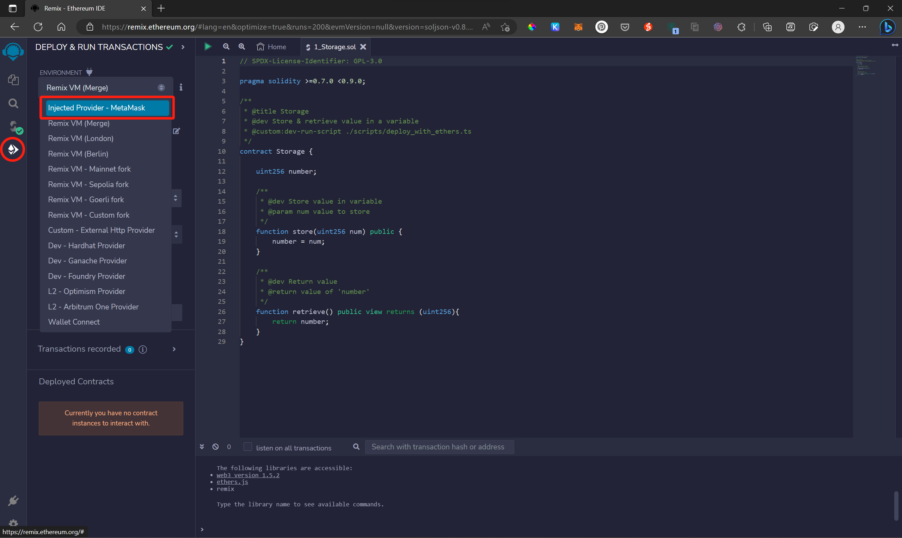
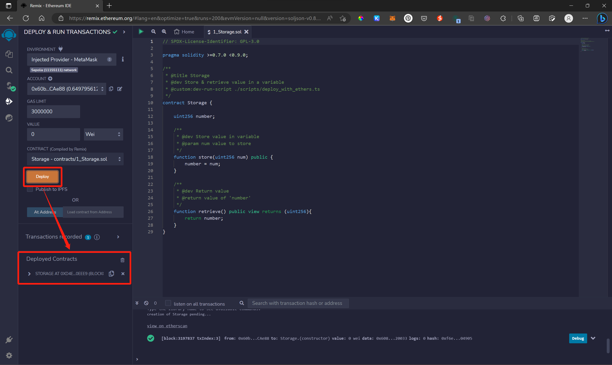
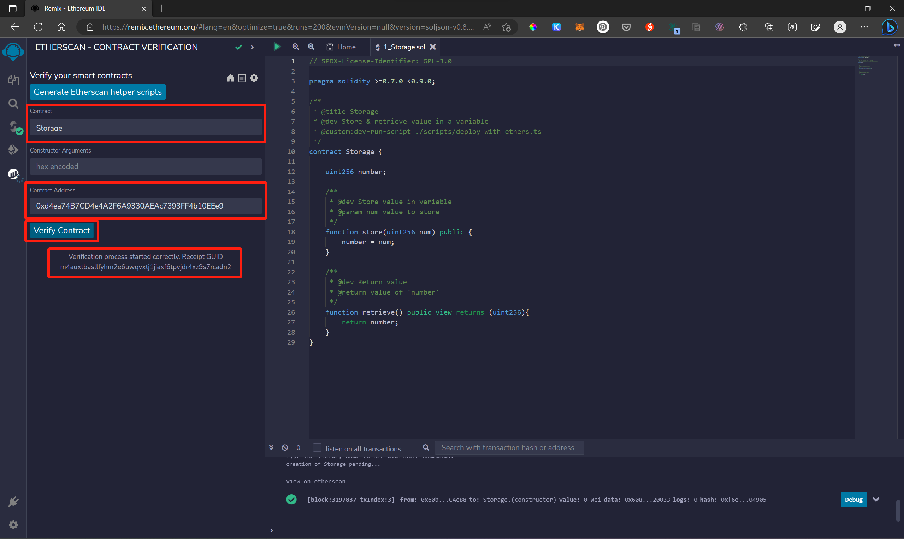

[README](..\README.md)

#如何在 Remix 上使用 ETHERSCAN - CONTRACT VERIFICATION 驗證智能合約

1. 在 [Remix](https://remix.ethereum.org/) 上 Activate 套件 ETHERSCAN - CONTRACT VERIFICATION

2. 選擇一個智能合約並 compile

3. 選擇 `Injected Provider - MetaMask` 作為 Deploy 環境

> 若選擇 "Remix VM" 作為部屬環境，則合約並不會部屬到 ETHERSCAN 所以儘管可以成功部屬，但 "ETHERSCAN - CONTRACT VERIFICATION" 會無法連接到該網路進行驗證

4. Deploy 成功後，複製智能合約的地址 (address)

5. 來到 ETHERSCAN - CONTRACT VERIFICATION 介面，選擇要驗證的智能合約，貼上其地址後，開始驗證
