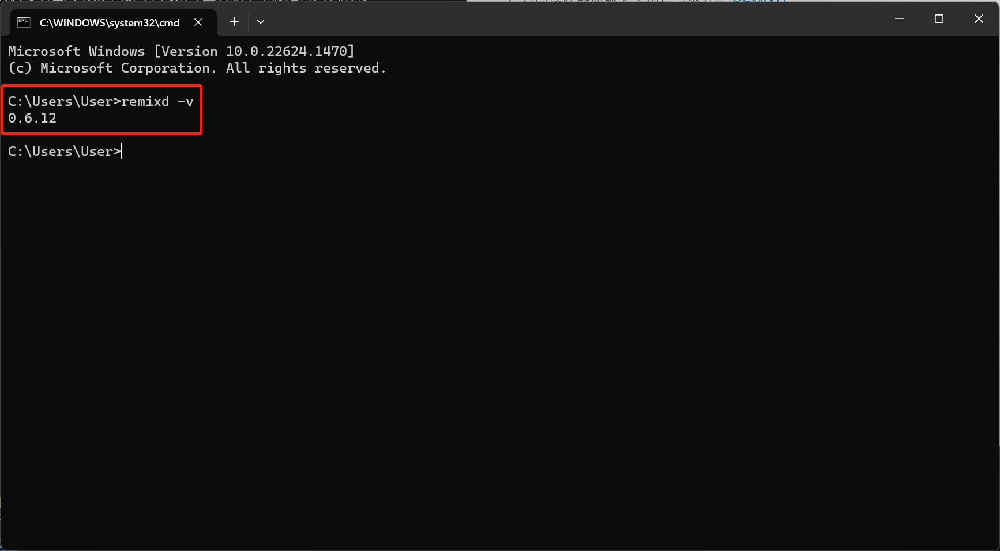
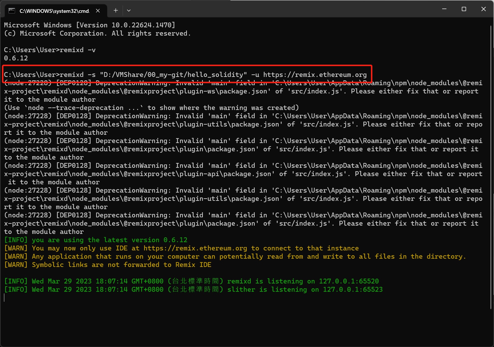
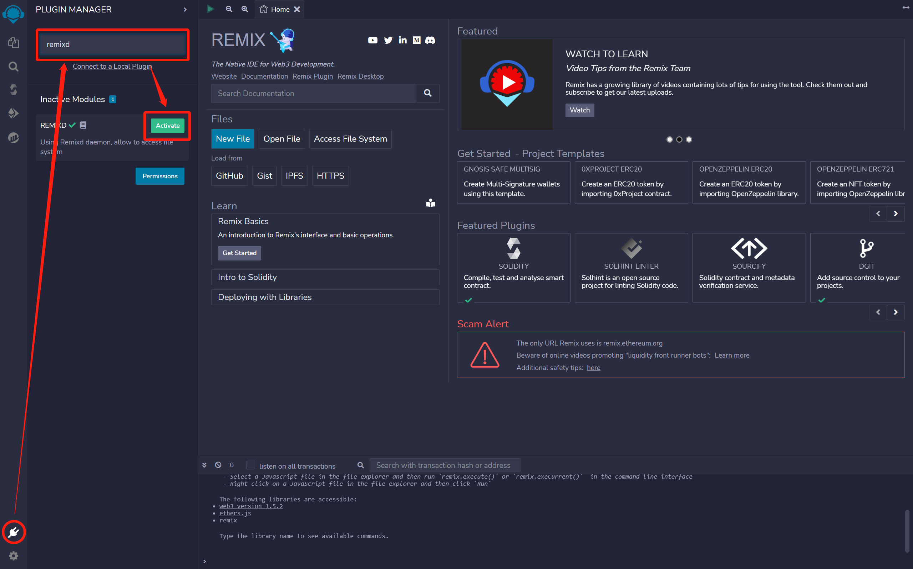
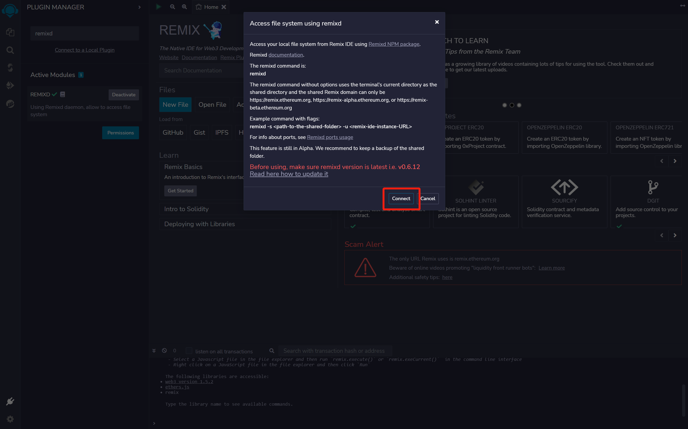
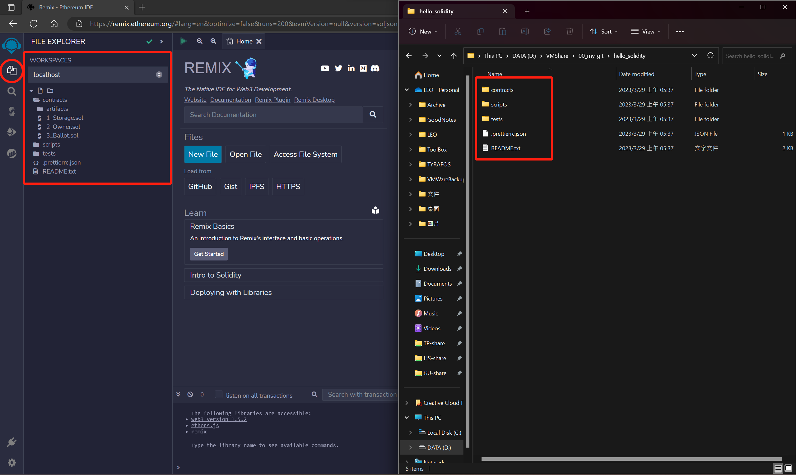

[README](..\README.md)

# 如何在 Remix 上使用 REMIXD 套件連結本地資料夾

1. 打開終端機並輸入下列指令來安裝 [REMIXD](https://github.com/ethereum/remix-project/tree/master/libs/remixd)
```
npm install -g @remix-project/remixd
```
2. 安裝完成後可以在終端機中輸入下列指令查看版本確認是否安裝成功
```
remixd -v
```

3. 在本地端任意路徑下創建開發用資料夾
4. 打開終端機輸入下列指令將資料夾連接到 REMIX IDE (請將 `<absolute-path-to-the-shared-folder>`改成要連接的資料夾路徑)
```
remixd -s <absolute-path-to-the-shared-folder> -u https://remix.ethereum.org
```

5. 打開 [REMIX IDE](https://remix.ethereum.org/) 並 Activate "REMIXD" 插件


6. 回到 REMIX IDE 的 File Explore 就可以看到已經跟本地端的資料夾同步
