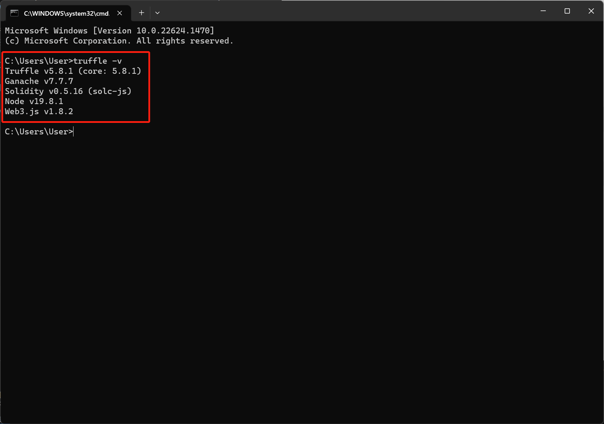
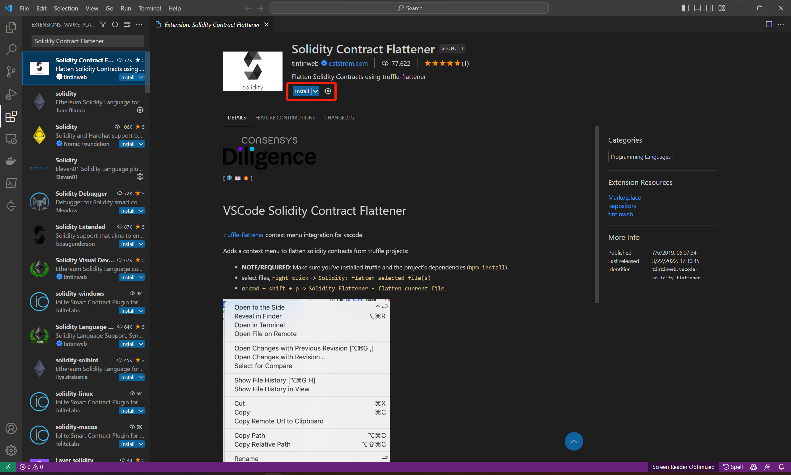
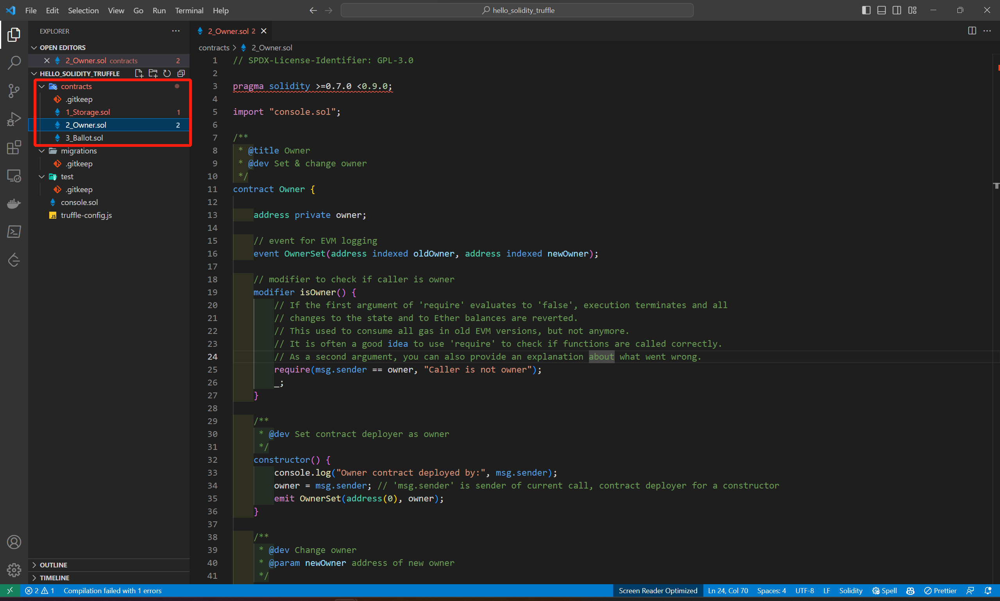
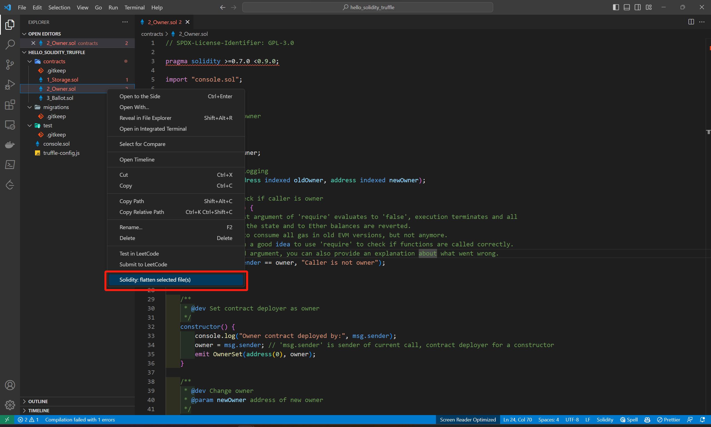
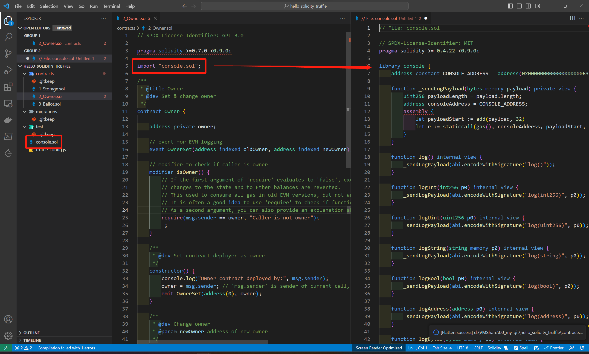

[README](..\README.md)

# 如何在 VSCode 中使用 Solidity Contract Flattener

1. 此套件相依於 [truffle](https://www.npmjs.com/package/truffle)，故須使用以下指令安裝
```
npm install -g truffle
```
2. 可用以下指令查看版本並確認是否安裝成功
```
truffle -v
```

3. 打開 [VSCode](https://code.visualstudio.com/download) 並安裝 [Solidity Contract Flattener](https://marketplace.visualstudio.com/items?itemName=tintinweb.vscode-solidity-flattener) 套件

4. 在任意路徑創建空資料夾，並於該資料夾路徑下輸入下列指令，初始化 truffle 的 Solidity 開發結構
```
truffle init
```
5. 用 VSCode 打開該資料夾，並在 `.\contracts` 中放入智能合約

6. 在要展開的文件上點滑鼠右鍵，點選 `Solidity: flatten select file(s)` 則會於新的文檔中將所有 import 的智能合約原始碼整合於同一份原始碼中

