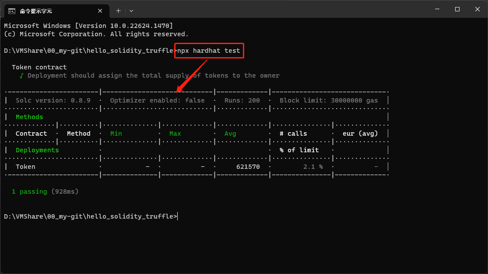

[README](..\README.md)

# 如何使用 hardhat-gas-reporter

[hardhat-gas-reporter](https://www.npmjs.com/package/hardhat-gas-reporter)

1. 完成 [Hardhat 初始化](Hardhat.md) 之後，輸入下列指令安裝套件
```
npm install hardhat-gas-reporter --save-dev
```
2. 在 `hardhat.config.js` 中添加
```
require("hardhat-gas-reporter");
```

3. `hardhat-gas-reporter` 是跟隨著 `test` 指令一起輸出
```
npx hardhat test
```
