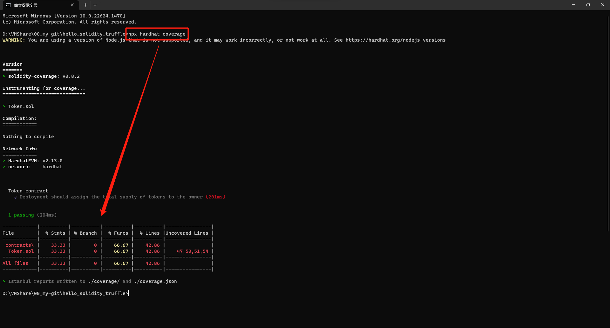

[README](..\README.md)

# 如何使用 solidity-coverage

[solidity-coverage](https://github.com/sc-forks/solidity-coverage/blob/master/HARDHAT_README.md)

1. 完成 [Hardhat 初始化](Hardhat.md) 之後，輸入下列指令安裝套件
```
npm install --save-dev solidity-coverage
```
2. 在 `hardhat.config.js` 中添加
```
require("solidity-coverage");
```

3. 輸入下列指令執行 `solidity-coverage`
```
npx hardhat coverage
```
