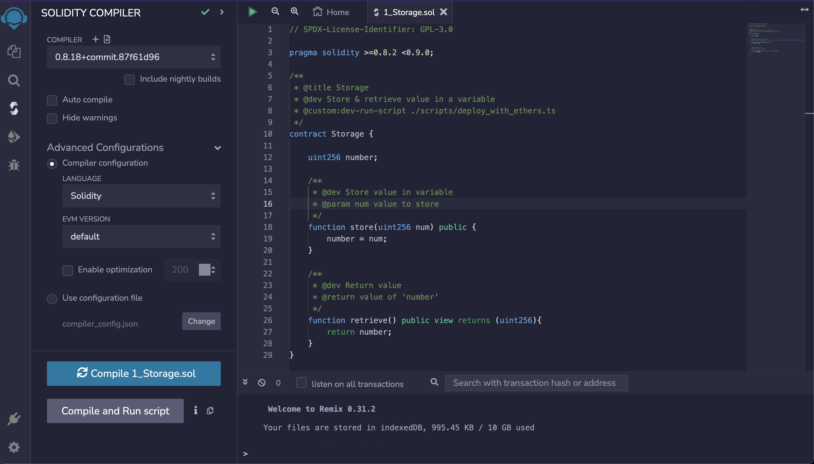
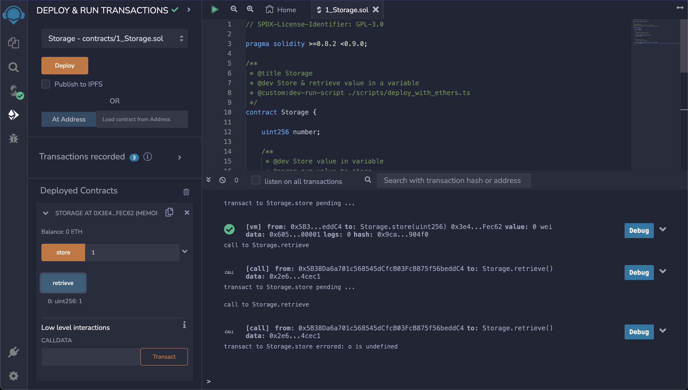
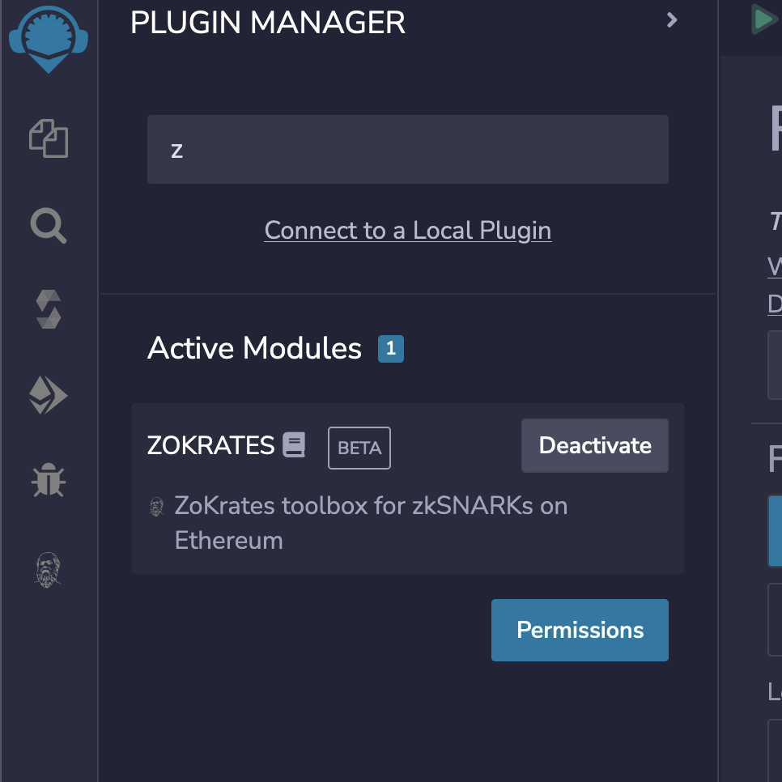
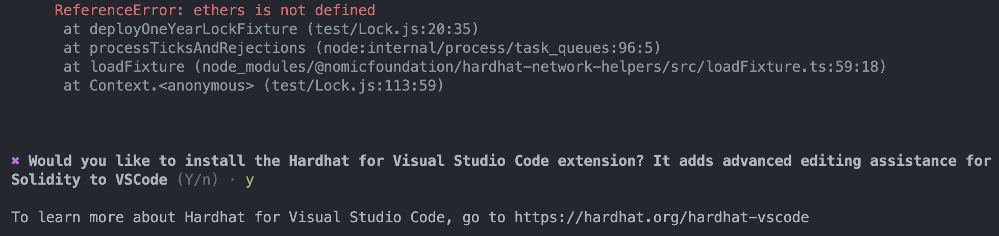

# w3 - individual

### Alchemy
- open alchemy
- create a new app
- get API KEY
- copy example of javascript, then replace address in file
    - get last block
    - Get all outbound transfers for a provided address
    - Get all the NFTs owned by an address
    - Listen to all new pending transactions

### Remix
- open remix
- create a new default workspace
    - use default files
- check out to Solidity compiler
    - i
    - select compile storage.sol
    - check compilation detail
- check out to Deploy & run transactions
    - 
    - deploy to goeli fork
    - check out deploy contract
    - use write storage and read retrive function
    - plugin ZoKrates 
        - not sure how to use it
        -
### OpenZeppelin and Hardhat, Hardhat test
- Go to Contracts page
- use installation
    `npm install @openzeppelin/contracts`
    `npm install --save-dev hardhat`

- import ERC721.sol in my sol file`
- Compiling Solidity
    - check hardhat.config.js.
        - replace content to module.export or it would be failed in comple
    - `npx hardhat compile`
        - use javascript project

- when run "npx hardhat test"
    - it will be lack some package
        - @nomicfoundation/hardhat-network-helpers
        - @nomicfoundation/hardhat-chai-matchers/withArgs
            - npm install --save-dev @nomicfoundation/hardhat-chai-matchers
    - but still error tests 

### Slither
- pip install slither-analyzer
- open vsCode
- install slither extension
- inside upper project then go to extension
- run slither
- not work
    - error
    raise argparse.ArgumentTypeError(
argparse.ArgumentTypeError: No solc version set. Run `solc-select use VERSION` or set SOLC_VERSION environment variable.`

### Mythril
- go to github page
    - https://github.com/ConsenSys/mythril
- install
    `pip3 install mythril`
- run mythril analyze `<file>`
- not work

### Reading and summary
- defi-attacks-flash-loans-centralized-price-oracles/
    - 閃電貸的攻擊可以是任何人，不限於鯨魚
    - 本質還是合約的漏洞
    - 最常見是價格預言機攻擊，且使用單個DEX的DeFi
    - Chainlink去中心化預言機，旨在解決此問題
    - 步驟
        1. 從dydx借出21kETH
        2.  buy 107k CHEESE in UniSwap
        3.  在 Uniswap 上存入 CHEESE 和 ETH，並接收 CHEESE/ETH Uniswap LP 代幣作為回報。
        4.  使用 LP 代幣鑄造 sUSD 代幣
        5.  在 Uniswap 上人為抬高 CHEESE 的價格
            - Cheese Bank價格預言機出問題
        7.  刷新 Cheese Bank 的餵價
        8.  從 Cheese Bank 中提取資金
        9.  將資金換成 ETH 以償還閃電貸
        10.  將 21k ETH 返還給 dYdX 以償還閃電貸

- https://consensys.github.io/smart-contract-best-practices/
    - 以太坊合約的最佳實踐
    - 中文版
        - https://github.com/ConsenSys/smart-contract-best-practices/blob/master/README-zh.md
    - 小心謹慎各種調用

- https://chain.link/education/blockchain-oracles
    -
