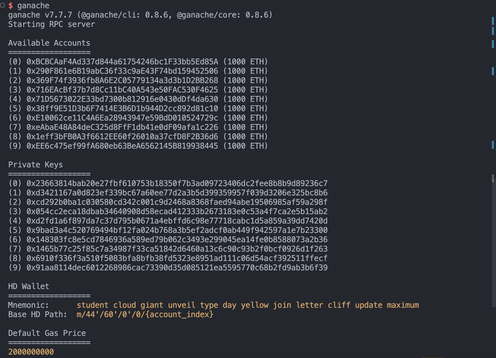

# w3 group
- TOPIC: mainnet fork with hardhat
    - 
    - update hardhat.config.js
    - run command
        `npx hardhat node --fork https://eth-mainnet.g.alchemy.com/v2/<key>`
    - connect metamask by import private key random of output
        - 
- TOPIC: 用 Ganache-cli 跑 local 的 ethereum mainnet fork 並 connect MetaMask
    - reference https://github.com/trufflesuite/ganache/tree/master
    - npm install ganache --global
    - run ganache
        - 
        - 
    - import private key to metamask
        - 
    - also saw example of install ganache in a node project but not pratice in this time
        - EIP-1193 example
        ```js=
        const ganache = require("ganache");
        const options = {};
        const server = ganache.server(options);
        const PORT = 0; // 0 means any available port
        server.listen(PORT, async err => {
          if (err) throw err;

          console.log(`ganache listening on port ${server.address().port}...`);
          const provider = server.provider;
          const accounts = await provider.request({
            method: "eth_accounts",
            params: []
          });
        });
        ```
- TOPIC: try zeroDev
    - 傳統
        - 使用**Fireblocks**或是**Wyre**等錢包供應商，透過API建立錢包
        - 要求用戶使用Metamask等非託管的錢包，或使用web3Auth, Magic生成錢包
        - 託管缺點 用戶不真正擁有資產
        - 非託管缺點 失去密鑰、處理gas fee很麻煩
    - 所以使用AA
        - 創建易於使用的非託管錢包，兩全其美
        - 允許智能合約發起交易
- ZeroDev 提供智能錢包服務，以帳戶抽象 (AA) 。
        1. 智能錢包工廠，可從任何身份驗證方法（包括私鑰、RPC 提供程序、OAuth/JWT、生物識別等）創建智能錢包。
        2. 用於構建自定義 AA 錢包的智能合約錢包核心，以及一組常見智能錢包功能的錢包插件，例如會話密鑰、訂閱等。
        3. 用於與智能錢包交互的 Ethers 和 Wagmi SDK。
        4. 用於設置細粒度的gas贊助政策的氣體贊助策略引擎，例如“僅為與合約 X 交互的每個用戶贊助價值為 0.01 ETH 的gas fee”。
        5. 打包網絡，將 AA 交易分佈到多個打包器提供程序，以確保高可用性。
    簡而言之，可以使用 ZeroDev 為客戶提供生產級智能錢包。

    - 要使用智能錢包，首先必須創建一個。使用 ZeroDev，您可以使用各種身份驗證方法創建智能錢包，包括私鑰、RPC 提供程序（例如 Web3Auth/Magic）、OAuth/JWT/Auth0，甚至是生物識別技術。
    - Contract Policies
        - 建立contract policies
    - known contract:
        - ??
    - ERC-4337 bundler
        - 看沒有很懂bundler的意思

    - paymasters
        - 如果使用ERC-4337 需要自己實作，也就是未user支付gas fee，但可以使用zeroDev就只要信用卡
    - 如何轉讓錢包
            - 以往是私鑰導出，用批量轉出，這樣就不用每種資產要批准+轉移


    - use zeroDev demo test
    - Supercharge Web3 UX with Account Abstraction
        - using google
            - 
        - mint NFT no gas fee (get polygon token by faucet)，由發NFT者出資手續費，由於可能會有被user耗盡手續費的問題，因此需要訂定gas policies，ex: 我只為每個user付10筆交易手續費
            - block explorer https://mumbai.polygonscan.com/address/0x9aA12D230A32De2aD045e0a785781d20f1D9b9Ab#tokentxnsErc721
            - 
    - getting-started
        - 
        - 因為要綁信用卡暫不實作
        - 可在儀表板制定gas fee規則
        - 寫一個可被mint NFT的合約，並無需支付gas fee
        - 使用AA可以bundler兩個NFT同時mint，節省gas fee，使用execBatch
        - 導出RainbowKit, connectKit, Web3Modal
