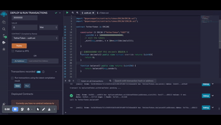

# (week5) 個人開發實作 


## Coding1
寫一個代幣合約，可以用 USDT 買到一個代幣、查到合約現有 USDT 餘額、與提款，提交完成程式碼，並附上成功買到代幣，查餘額跟提款在 remix 的截圖



```
<!--  代幣的 contract -->

// SPDX-License-Identifier: MIT

pragma solidity ^0.8.0;

import "@openzeppelin/contracts/token/ERC20/ERC20.sol";
import "@openzeppelin/contracts/token/ERC20/IERC20.sol";

contract myCustomToken is ERC20 {
    // 這邊放的網址為我部署 USDT 合約的網址
    address private _token = 0xC8A5708565FB3Af7B9Ed7619218f0fcC171E27F0; 
    
    constructor() ERC20("myCustomToken", "v-token") {}

    // use USDT to mint
    function mint() external {

        IERC20(_token).transferFrom(
            msg.sender,
            address(this),
            1000000  // USDT 有六位小數
        );
        _mint(msg.sender, 1 ether);
    }

    function withdrawToken(address _tokenContract, uint256 _amount) external {
        IERC20 tokenContract = IERC20(_tokenContract);
        
        // transfer the token from address of this contract
        // to address of the user (executing the withdrawToken() function)
        tokenContract.transfer(msg.sender, _amount);
    }

}
```


```
<!--  USDT 的 contract -->

// SPDX-License-Identifier: MIT

pragma solidity ^0.8.4;

import "@openzeppelin/contracts/token/ERC20/ERC20.sol";
import "@openzeppelin/contracts/token/ERC20/IERC20.sol";

contract TetherToken is ERC20{

    constructor () ERC20 ("TetherToken","USDT"){
         uint256 n = 100000000000000000000;
        // mint the tokens
        _mint(msg.sender, n * 10**uint(decimals()));  

    }
    
    // 這邊因為是模擬 USDT 所以 decimals 要設定為 6
    function decimals() public view virtual override returns (uint8){
        return 6;
    }

    function balance() public view returns (uint256) {
        return balanceOf(msg.sender);
    }
    
}
```


---


## Coding2 (＊)

### **沒有完成，卡在不知道如何付兩種幣**
寫一個 NFT 合約，需要同時付以上的 ERC20 代幣加上 0.1 ETH 才能 mint 到，並且可以更新 token URI，每個地址只能 mint 5 個，提交完成程式碼，並附上截圖


--

我這裡有限制一次只能 mint 一個 NFT


> Q1.不知道怎麼扣兩種幣，是直接在 mint() 裡面 transfer 兩次嗎
> Q2.當我需要用到 v-token 幣的合約在 NFT 合約時，能怎麼做
> Q3.MyToken可以用ERC20()取代嗎

```
//SPDX-License-Identifier: MIT

pragma solidity ^0.8.0;

import "@openzeppelin/contracts/token/ERC1155/ERC1155.sol";
import "@openzeppelin/contracts/access/Ownable.sol";
import "@openzeppelin/contracts/utils/Strings.sol";

import "@openzeppelin/contracts/token/ERC20/ERC20.sol";
import "@openzeppelin/contracts/token/ERC20/IERC20.sol";

contract myCustomToken is ERC20 {
    // 這邊放的網址為我部署 USDT 合約的網址
    address private _token = 0xC8A5708565FB3Af7B9Ed7619218f0fcC171E27F0; 
    
    constructor() ERC20("myCustomToken", "v-token") {}

    // use USDT to mint
    function mint() external {

        IERC20(_token).transferFrom(
            msg.sender,
            address(this),
            1000000  // USDT 有六位小數
        );
        _mint(msg.sender, 1 ether);
    }

    function withdrawToken(address _tokenContract, uint256 _amount) external {
        IERC20 tokenContract = IERC20(_tokenContract);
        
        // transfer the token from address of this contract
        // to address of the user (executing the withdrawToken() function)
        tokenContract.transfer(msg.sender, _amount);
    }

}


contract myNft is Ownable, ERC1155 {

    uint256 public constant MAX_MINT = 5;
    // _tokenAddress 為我部署我的 v-token 地址
    address private constant _tokenAddress =
        0xAe2563b4315469bF6bdD41A6ea26157dE57Ed94e;
    
    constructor(string memory _uri) ERC1155(_uri) {
    }

    function setURI(string memory newuri) public onlyOwner {
        _setURI(newuri);
    }
    

    function mint(address payable _addr) external {
        require(balanceOf(msg.sender, 0) < MAX_MINT, "Can only mint 5 NFT per address");
        require(msg.value == 1 ether, "Not enough");
        
        myCustomToken(_tokenAddress).transferFrom(
            msg.sender,
            address(this),
            1 ether //10**18
        );
        
        // mint
        _mint(msg.sender, 0, 1, "");
    }
}
```
    
    


---

## [<Swap/> with Uniswap](https://azfuller20.medium.com/swap-with-uniswap-wip-f15923349b3d )


For our widget, we are interested in exchanging one token for another, so we then need to specify three things:


All you could possibly need

* The token we have: tokenIn
* The token we want: tokenOut
* A fixed amount, specified either in tokenIn or tokenOut You can specify either the amount of tokens you have (EXACT_INPUT), or the amount of tokens you want (EXACT_OUTPUT). The other side will then be determined at point of transaction.

--

### Forking main-net side-quest 

Hardhat (f.k.a. Buidler) has an excellent [mainnet forking](https://hardhat.org/hardhat-network/docs/guides/forking-other-networks) option which allows you to snapshot the latest state of mainnet, using that as the foundation for your locally running network.

be done with a single command from within scaffold-eth:

```
yarn fork
```

Alchemy API comes highly recommended.

--

### The Uniswap SDK 

provide a [javascript SDK](https://docs.uniswap.org/sdk/v3/overview) for developers

* Entities: the classes which make up the Uniswap protocol (Tokens, Pairs, Trades etc.), with associated helper functions (for doing calculations & transformations).
* An easy way to Fetch the current on-chain state of Uniswap Pairs (i.e. the reserves of each Token).


There are some important things that the SDK **doesn’t do**:

* It doesn’t know about specific tokens. The developer has to know about the erc20 tokens of interest, which is where Token Lists come in 
* It doesn’t know about ETH. While Ether is a first-class citizen when interacting with the Router, within the SDK you have to treat ETH as Wrapped ETH (WETH) 
* It doesn’t prepare or send transactions. The developer has to take the information about potential Trades from the SDK and prepare the appropriate transactions to actually exchange tokens with Uniswap 

--

### Token List side-quest 

Any project on Ethereum that maintains a list of ERC20 tokens hosts this list publicly following a standard JSON schema. Projects attach their reputation to lists by hosting them on a domain they control.

<Swap/> uses the Uniswap default token list as its input tokenListURI, but the parameter can take any token list JSON URI following the Token List standard.

--

### Estimating trades with the SDK

The Pair can tell us the amounts in reserve for each token, which is enough to calculate the price for different amounts, via the constant product — this is the only thing the SDK goes on-chain for! 

```
import { ChainId, Token, WETH, Fetcher } from '@uniswap/sdk'
const DAI = new Token(ChainId.MAINNET, '0x6B175474E89094C44Da98b954EedeAC495271d0F', 18)
const pair = await Fetcher.fetchPairData(DAI, WETH[DAI.chainId], provider)
```


 create the Route for the trade (i.e. we are going from tokenIn to tokenOut), then to create a new Trade using that route and our fixed amount. That Trade entity can then give us the information about the variable amount we can expect, as well as other metrics about the trade (executionPrice, nextMidPrice, priceImpact etc.)
 
```
const DAI_TO_ETH = new Route([pair], DAI)
const trade = new Trade(DAI_TO_ETH, new TokenAmount(DAI, '1000000000000000'), TradeType.EXACT_INPUT)
```

This is highlights the freshest bit of the SDK, which provides two functions (bestTradeExactIn and bestTradeExactOut) which, given a list of Pairs, will find the trade with the best estimated price

```
Trade.bestTradeExactIn(
    pairs: Pair[],
    amountIn: TokenAmount,
    tokenOut: Token,
    { maxNumResults = 3, maxHops = 3 }: BestTradeOptions = {}): 
```

* Create a list of “Base” tokens, plus the tokens selected by the user 
* Get Pair information for all the possible combinations of the tokens in our list, where a Pair contract exists 
* Use the relevant bestTrade method to identify the optimum Route from tokenIn to tokenOut across all those Pairs, and the estimated variable amount and corresponding price 

--

### What are our safety parameters? 

Uniswap has some built in controls to ensure that Swaps don’t go badly wrong. While a given trade will only specify one of an amountIn or an amountOut, the upper or lower bound for the other side is an additional parameter, as amountInMax or amountInMin.

The <Swap/> default is ten minutes after the transaction, with trade failing after that point.

--

### Are we trading tokens or ETH?

six potential swap varieties

* swapExactTokensForTokens
* swapTokensForExactTokens
* swapExactETHForTokens
* swapTokensForExactETH
* swapExactTokensForETH
* swapETHForExactTokens

--

### steps

* Pull it into your scaffold-eth branch to let your users easily move between erc20s
* Update it to work with non-mainnet Uniswap deployments (testnets, [Honeyswap](https://honeyswap.org/#/))
* Extend the widget to visualise the changing price for different trade sizes
* Set up a TWAP Swap
* Build in other liquidity providers to get even better pricing (next stop 1inch!)
* Get racy with Flash Swaps
* Strip it down to a simple Swap button to keep things simple
* [Your idea here!]

--


note 

```
1. “Uniswap is an automated liquidity protocol powered by a constant product formula and implemented in a system of non-upgradeable smart contracts on the Ethereum blockchain” 
2. https://github.com/scaffold-eth/scaffold-eth-examples/tree/uniswapper
3. <Swap/> uses the Uniswap default token list as its input tokenListURI, but the parameter can take any token list JSON URI following the Token List standard.
4. The <Swap/> default is ten minutes after the transaction, with trade failing after that point.
```
---


## [Uniswapper](https://docs.scaffoldeth.io/scaffold-eth/examples-branches/defi/uniswapper)


```
git clone -b uniswapper https://github.com/scaffold-eth/scaffold-eth-examples.git uniswapper-scaffold

cd uniswapper-scaffold

yarn install

// 需要等另外一個終端機 yarn fork 成功後再run
yarn start
```


[中間有出現錯誤](https://stackoverflow.com/questions/69692842/error-message-error0308010cdigital-envelope-routinesunsupported)，輸入以下指令已解決

```
export NODE_OPTIONS=--openssl-legacy-provider
```


--

再開一個 terminal

```
yarn fork 
```


--

畫面成功出現！


---

## 課外好文

[Uniswap v2 實作 : 從創建交易對到Ether 換 Dai 投入 Compound](
https://medium.com/taipei-ethereum-meetup/uniswap-v2-implementation-and-combination-with-compound-262ff338efa)
