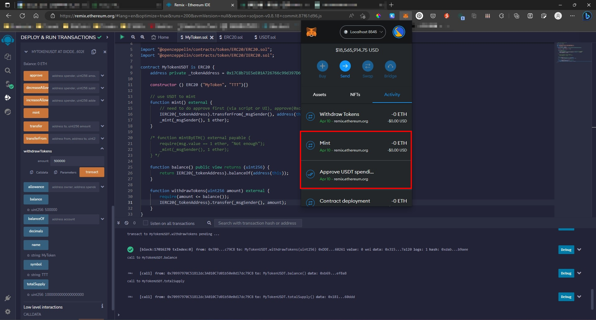
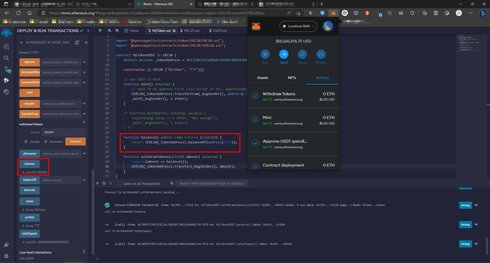
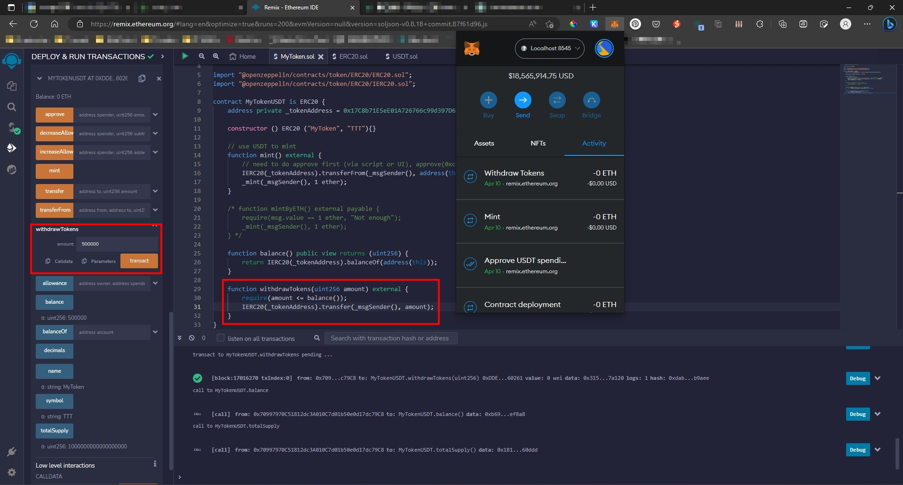

1. 寫一個代幣合約，可以用 USDT 買到一個代幣、查到合約現有 USDT 餘額、與提款，提交完成程式碼，並附上成功買到代幣，查餘額跟提款在 remix 的截圖
   - 小考的程式碼片段：[https://github.com/z-institute/Quiz/blob/main/Quiz_04.sol](https://github.com/z-institute/Quiz/blob/main/Quiz_04.sol)

    ```solidity
    // SPDX-License-Identifier: MIT

    pragma solidity ^0.8.0;

    import "@openzeppelin/contracts/token/ERC20/ERC20.sol";
    import "@openzeppelin/contracts/token/ERC20/IERC20.sol";

    contract MyTokenUSDT is ERC20 {
        address private _tokenAddress = 0x17C8b71E5eE01A726766c99d397D619219C8CAF3;

        constructor() ERC20("MyToken", "TTT") {}

        // use USDT to mint
        function mint() external {
            // need to do approve first (via script or UI), approve(0xcontract, 1000000)
            IERC20(_tokenAddress).transferFrom(
                _msgSender(),
                address(this),
                1000000
            );
            _mint(_msgSender(), 1 ether);
        }

        function balance() public view returns (uint256) {
            return IERC20(_tokenAddress).balanceOf(address(this));
        }

        function withdrawTokens(uint256 amount) external {
            require(amount <= balance());
            IERC20(_tokenAddress).transfer(_msgSender(), amount);
        }
    }
    ```

   - mint 成功截圖
   
   - 查詢餘額成功截圖 (原本是 1000000, 因為 withdraw 了 500000 所以剩下 500000)
   
   - 提款成功截圖
   

2. 寫一個 NFT 合約，需要同時付以上的 ERC20 代幣加上 0.1 ETH 才能 mint 到，並且可以更新 token URI，每個地址只能 mint 5 個，提交完成程式碼，並附上截圖
3. 加分題：先閱讀：[https://azfuller20.medium.com/swap-with-uniswap-wip-f15923349b3d](https://azfuller20.medium.com/swap-with-uniswap-wip-f15923349b3d) 再跟著指示跑起這個專案 [https://docs.scaffoldeth.io/scaffold-eth/examples-branches/defi/uniswapper](https://docs.scaffoldeth.io/scaffold-eth/examples-branches/defi/uniswapper) 對於 DeFi 了解會加深很多，下次上課會講到，建議可以先看比較跟得上
