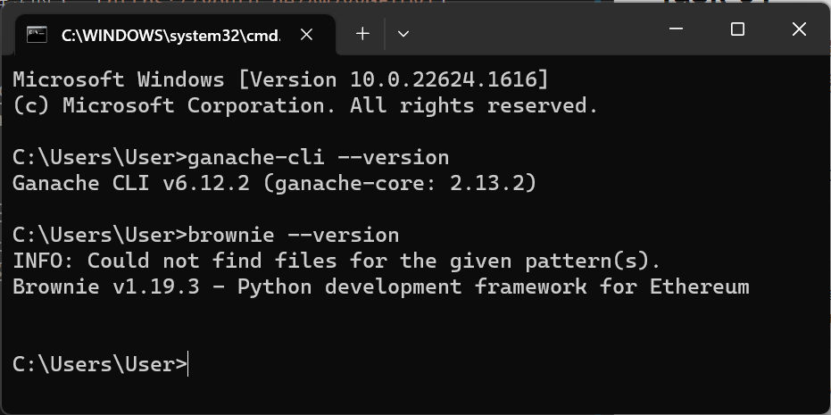
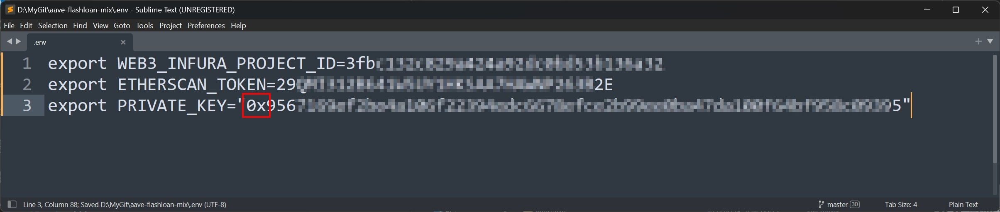
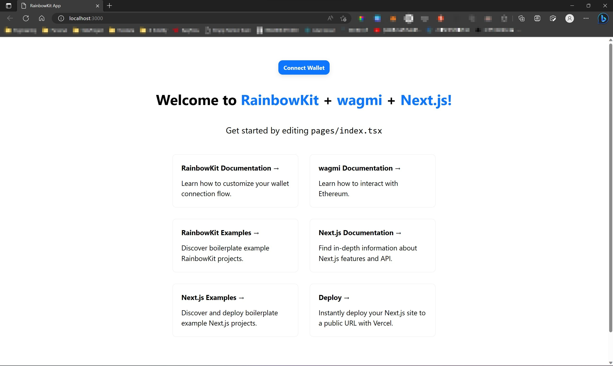

### Task-01
* 嘗試跟著這個影片的範例做一遍，把專案推到 Github 上，再寫下詳細步驟截圖，簡述運作原理與實作心得（中間是否遇到什麼困難，是怎麼解決的）：[https://youtu.be/Aw7yvGFtOvI](https://youtu.be/Aw7yvGFtOvI)

1. 安裝 [Python3](https://www.python.org/) for pip & [Node.js](https://nodejs.org/zh-tw) for npm
   **Note:** 在 Windows 上建議安裝 Python 3.10.x 版本，目前使用 3.11.x 版本進行 eth-brownie 安裝會有問題。
2. 打開 terminal 安裝 [Brownie](https://eth-brownie.readthedocs.io/en/stable/install.html) & [Ganache-CLI](https://github.com/trufflesuite/ganache)
   ```
   npm install -g ganache-cli
   pip install eth-brownie
   ```
3. 確認套件安裝成功
   ```
   ganache-cli --version
   brownie --version
   ```
   
4. 將[此專案](https://github.com/PatrickAlphaC/aave-flashloan-mix) clone 到本地端
5. 註冊 [Infura](https://infura.io/) 並產生 API key，將 API key 填入到 `.env` 這個檔案的 `WEB3_INFURA_PROJECT_ID` 這個參數中
   註冊 [Etherscan](https://etherscan.io/) 並產生 API key，將 API key 填入到 `.env` 這個檔案的 `ETHERSCAN_TOKEN` 這個參數中

6. 按照順序執行下列指令
   ```
   brownie run scripts\get_weth.py --network kovan
   brownie run scripts\deployment_v2.py --network kovan
   brownie run scripts\run_flash_loan_v2.py --network kovan
   ```

#### Questions
* kovan testnet 已經不能使用，不知道該如何切換 testnet 或是使用 Localhost 當作 testnet

### Task-02
* [加分作業，下次上課會講但建議先看] Follow 此教學創建一個模板專案，並提供完成截圖，熟悉此專案架構，若對 React 框架還不熟悉的同學也可以先去了解 React：[https://www.rainbowkit.com/docs/installation](https://www.rainbowkit.com/docs/installation)
* 完成截圖
  