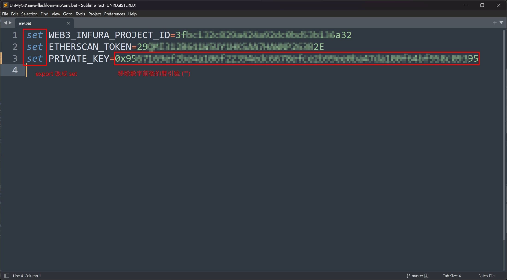
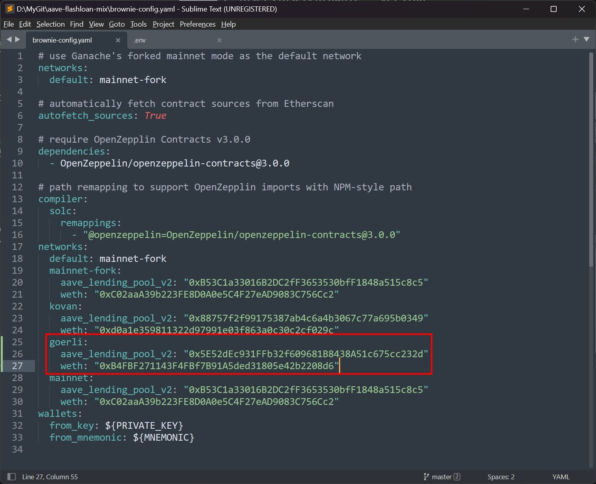
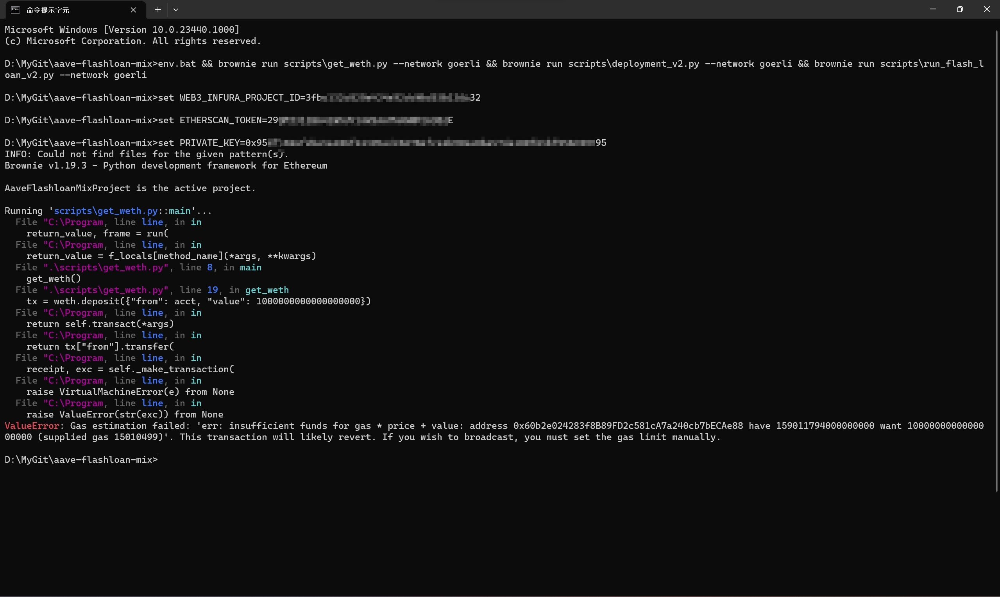

### Task-01
* 嘗試跟著這個影片的範例做一遍，把專案推到 Github 上，再寫下詳細步驟截圖，簡述運作原理與實作心得（中間是否遇到什麼困難，是怎麼解決的）：[https://youtu.be/Aw7yvGFtOvI](https://youtu.be/Aw7yvGFtOvI)

1. 安裝 [Python3](https://www.python.org/) for pip & [Node.js](https://nodejs.org/zh-tw) for npm
   **Note:** 在 Windows 上建議安裝 Python [3.10.x](https://www.python.org/downloads/release/python-31011/) 版本，目前使用 3.11.x 版本進行 eth-brownie 安裝會有問題。
2. 打開 terminal 安裝 [Brownie](https://eth-brownie.readthedocs.io/en/stable/install.html) & [Ganache-CLI](https://github.com/trufflesuite/ganache)
   ```
   npm install -g ganache-cli
   pip install eth-brownie
   ```
3. 確認套件安裝成功
   ```
   ganache-cli --version
   brownie --version
   ```
   
4. 將[此專案](https://github.com/PatrickAlphaC/aave-flashloan-mix) clone 到本地端或是執行 `brownie bake aave-flashloan` 下載 mix
5. * 註冊 [Infura](https://infura.io/) 並產生 API key，將 API key 填入到 `.env` 這個檔案的 `WEB3_INFURA_PROJECT_ID` 這個參數中
   * 註冊 [Etherscan](https://etherscan.io/) 並產生 API key，將 API key 填入到 `.env` 這個檔案的 `ETHERSCAN_TOKEN` 這個參數中
   * 打開 MetaMask 並轉到 Goerli 測試網，選擇要使用的 Account，導出其 private key 填到 `.env` 這個檔案的 `PRIVATE_KEY` 這個參數中 (記得最前面要加 '0x')

   
   **Note:** 如果是 Windows 系統，須將 `.env` 檔名改成 `evn.bat` 並且將內容修改成如下圖所示
   
6. 因為 ETH 的 Kovan 測試網已經不再使用，所以按照 [AAVE 開發手冊的建議](https://docs.aave.com/developers/v/2.0/deployed-contracts/deployed-contracts)，在 `brownie-config.yaml` 添加相關網路參數，使用 Goerli 測試網。
   * [aave_lending_pool_v2 合約地址](https://goerli.etherscan.io/address/0x5E52dEc931FFb32f609681B8438A51c675cc232d#code)
   * [WETH Token 地址](https://goerli.etherscan.io/token/0xb4fbf271143f4fbf7b91a5ded31805e42b2208d6)

   
7. 按照順序執行下列指令
   ```bash
   # Linux or macOS
   brownie run scripts/get_weth.py --network goerli
   brownie run scripts/deployment_v2.py --network goerli
   brownie run scripts/run_flash_loan_v2.py --network goerli
   # Windows
   env.bat && brownie run scripts\get_weth.py --network goerli && brownie run scripts\deployment_v2.py --network goerli && brownie run scripts\run_flash_loan_v2.py --network goerli
   ```
   因為我的 Goerli 測試網的 ETH 儲備不足，無法繼續往下走，但至少所有參數都有抓到，並且順利執行，待測試幣充足，再來補上後續。
   

### Task-02
* [加分作業，下次上課會講但建議先看] Follow 此教學創建一個模板專案，並提供完成截圖，熟悉此專案架構，若對 React 框架還不熟悉的同學也可以先去了解 React：[https://www.rainbowkit.com/docs/installation](https://www.rainbowkit.com/docs/installation)
* 完成截圖
  