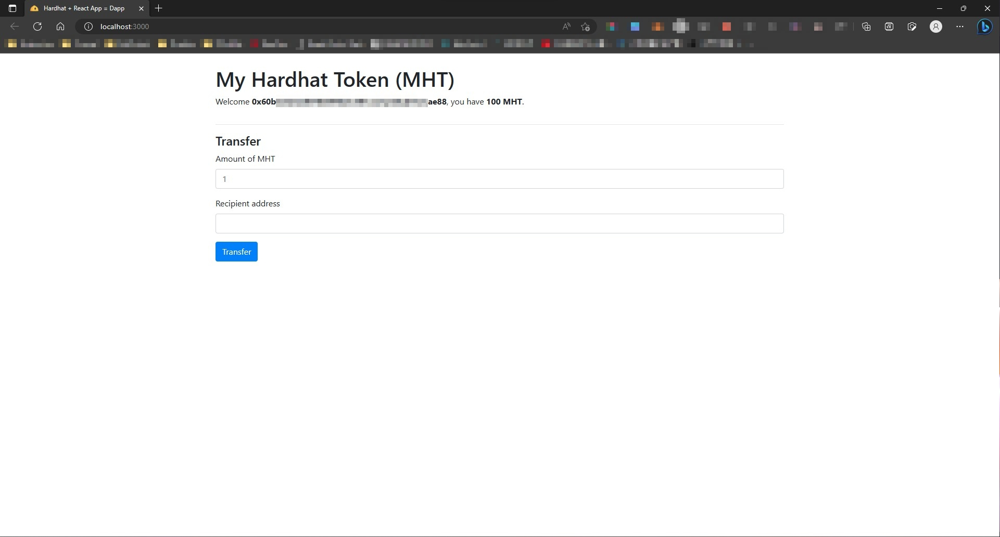

1. 看著 Quiz2 的合約（[在此](https://github.com/z-institute/Quiz/blob/main/contracts/Quiz_02.sol)），嘗試用 Hardhat 框架寫出 Quiz2 合約的 test，並跑 npx hardhat coverage，把測試涵蓋率提高到 100%
    1. 遇到困難的話可以看答案，但建議先自己嘗試後，真的想不到再對照：[https://github.com/z-institute/Quiz/blob/main/test/Quiz_02.test.js](https://github.com/z-institute/Quiz/blob/main/test/Quiz_02.test.js)
2. 跑起這個 Hardhat 前端專案，並觀察他的專案架構，用自己的話寫出『前端是怎麼樣呼叫智能合約的？』
    1. https://github.com/NomicFoundation/hardhat-boilerplate

   智能合約編譯完成後，會產生對應的 json 檔案，裡面包含了 contract 的 ABI (類似於 API) 跟 bytecode。
   前端可以透過 Node.js 套件 `ethers` 透過下列語法將智能合約於前端初始化：
   ```javascript
   this._token = new ethers.Contract(
    contractAddress.Token,
    TokenArtifact.abi,
    this._provider.getSigner(0)
   );
   ```
   接著前端就可以如同使用一般 API 的方式呼叫合約函式，例如要呼叫 `balanceOf` 就可以使用類似下列範例程式碼的方法：
   ```javascript
   // 記得要使用 async / await
   async _updateBalance() {
    const balance = await this._token.balanceOf(this.state.selectedAddress);
    this.setState({ balance });
   }
   ```

   * Hardhat 前端專案完成畫面

   