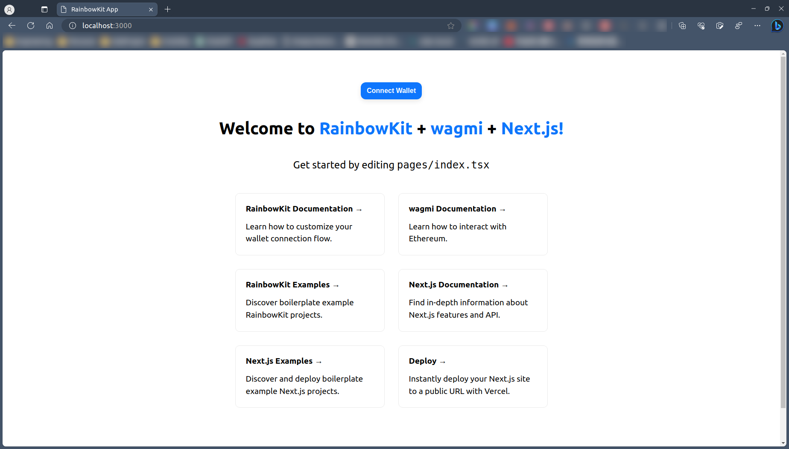

1. Follow 此文件並寫下做法與提供完成截圖：[https://hackmd.io/@zinstitute/frontend-lib](https://hackmd.io/@zinstitute/frontend-lib)
   * Rainbowkit + WAGMI
     ```
     npm init @rainbow-me/rainbowkit@latest
     cd {rainbowkit_project_folder}
     npm run dev
     ```
     
   * Web3Modal
     TBD
   * Manifold
     ```
     npm install @manifoldxyz/creator-core-solidity
     ```

2. 使用 Manifold studio 做任意一件事（如隨便上傳一張 NFT 圖片做成 NFT mint site），並寫下做法與提供完成截圖、網站連結
